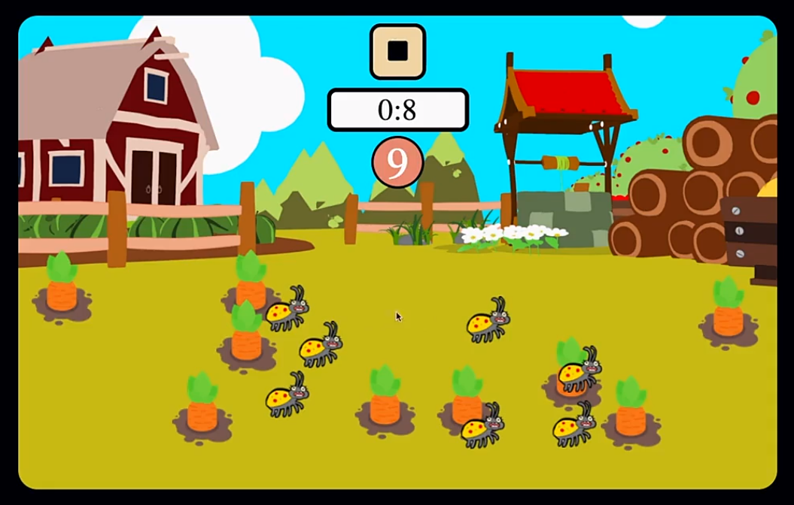

# carrotGame

<h2> 주석 설명</h2>
'>' : 주의사항 및 참고사항 
'(+)': 다른 코드와 연관된 사항

<h2> 드림코딩 프로젝트-당근 게임 </h2>
제한 시간 내에 당근을 모두 선택하면 이기는 게임  벌레를 선택시 혹은 시간이 모두 지나면 패배한다.
<h3> 예시 이미지<h3>

<h2> 게임 클래스 및 함수 </h2>

- 🟪게임 플레이 버튼 관리 - class onGame()
- 🟪게임 시작 버튼을 누를 시 게임 시작 - onStart()
- 🟪게임 정지 버튼을 누를 시 게임 종료 - onStop()

  > 게임 시작 버튼 클릭 이후에 실행 
  > 모두 초기화(onStart() 이전 상태로 전환)

- 🟪게임 결과 - class resultGame()

  - 🟪게임 승리 - winGame()
  - 🟪게임 패배 - loseGame()

- 🟪게임의 정보 - class ingameInform(carrotCount, bugCount, time)

  1. carrotCount: 당근의 개수 지정함
  2. bugCount: 벌레의 개수를 지정함
  3. time: 제한 시간을 지정함

  - 🟪당근이 정해진 공간안에 생성 - makeCarrot()

    > 게임 시작 버튼 클릭 이후에 실행

    - 🟪당근 선택 시 당근의 개수 view 1개씩 감소 
    - (+)당근 터치 시 음악 실행 playMusic()#playPickCarrot()

  - 🟪벌레가 정해진 공간안에 생성 - makeBug()

    > 게임 시작 버튼 클릭 이후에 실행 

    - (+)벌레 터치 시 게임 패배 resultGame()#loseGame() 
    - (+)벌레 터치 시 음악 실행 playMusic()#playPickBug() 
    - (+)벌레 터치 음악 종료 후 패배 음악 실행 playMusic()#playLoseMusic()

  - 🟪당근의 개수가 나옴 - viewCarrotCount()

    > 게임 시작 버튼 클릭 이후에 실행

    - (+)0이 되면 게임 승리 resultGame()#winGame()
    - (+)0이 되면 음악 실행 playMusic()#playWinMusic()

  - 🟪타이머 시작 - startTimer()
    > 게임 시작 버튼 클릭 이후에 실행
    - (+)0이 되면 게임 패배 resultGame()#loseGame()
    - (+)0이 되면 음악 실행 playMusic()#playLoseMusic()

- 🟪음악 실행 - class playMusic()
  - 🟪게임 진행 음악 실행 - playBGM()
  - 🟪게임 패배 시 음악 실행 - playLoseMusic()
  - 🟪게임 승리 시 음악 실행 - playWinMusic()
  - 🟪게임 중 벌레 선택 시 음악 실행 - playPickBug()
  - 🟪게임 중 당근 선택 시 음악 실행 - playPickCarrot()
