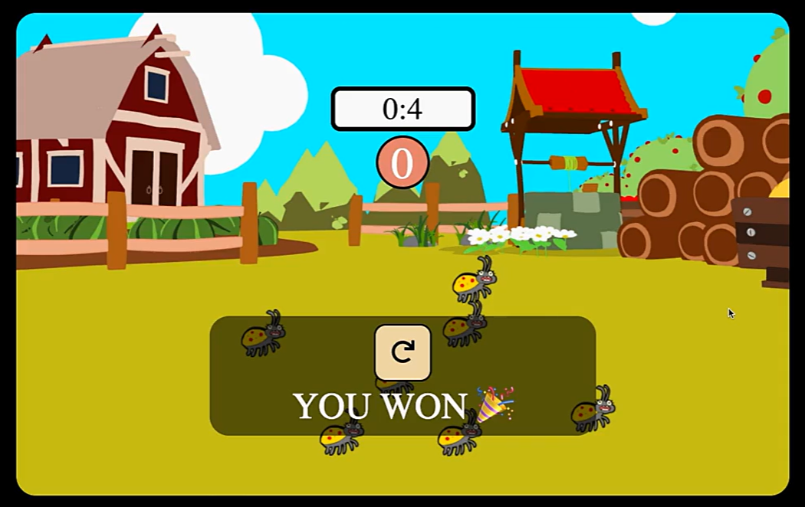

# carrotGame

<h2> 주석 설명</h2>
'>' : 주의사항 및 참고사항 
'(+)': 다른 코드와 연관된 사항

<h2> 드림코딩 프로젝트-당근 게임 </h2>
제한 시간 내에 당근을 모두 선택하면 이기는 게임  벌레를 선택시 혹은 시간이 모두 지나면 패배한다.
<h3> 예시 이미지<h3>

<h2> 게임 클래스 및 함수 </h2>

- 🟩게임 플레이 버튼 관리 - class onGame

  - 🟩게임 시작 버튼을 누를 시 게임 시작 - onStart()
  - 🟩게임 정지 버튼을 누를 시 게임 종료 - onStop()
    > 게임 시작 버튼 클릭 이후에 실행 
    > 모두 초기화(onStart() 이전 상태로 전환)

- 🟩게임 결과 - class resultGame

  - 🟩게임 승리 - winGame()
  - 🟩게임 패배 - loseGame()

- 🟩게임의 정보 - class ingameInform : carrotCount, bugCount, time

  1. carrotCount: 당근의 개수 지정함
  2. bugCount: 벌레의 개수를 지정함
  3. time: 제한 시간을 지정함

  - 🟩당근이 정해진 공간안에 생성 - makeCarrot()

    > 게임 시작 버튼 클릭 이후에 실행

    - 🟩당근 선택 시 당근의 개수 view 1개씩 감소 
    - (+)당근 터치 시 음악 실행 playMusic()#playPickCarrot()

  - 🟩벌레가 정해진 공간안에 생성 - makeBug()

    > 게임 시작 버튼 클릭 이후에 실행 

    - (+)벌레 터치 시 게임 패배 resultGame()#loseGame() 
    - (+)벌레 터치 시 음악 실행 playMusic()#playPickBug() 
    - (+)벌레 터치 음악 종료 후 패배 음악 실행 playMusic()#playLoseMusic()

  - 🟩당근의 개수가 나옴 - viewCarrotCount()

    > 게임 시작 버튼 클릭 이후에 실행

    - (+)0이 되면 게임 승리 resultGame()#winGame()
    - (+)0이 되면 음악 실행 playMusic()#playWinMusic()

  - 🟩타이머 시작 - startTimer()
    > 게임 시작 버튼 클릭 이후에 실행
    - (+)0이 되면 게임 패배 resultGame()#loseGame()
    - (+)0이 되면 음악 실행 playMusic()#playLoseMusic()

- ✅음악 실행 - class musicCotrol : audio

1. audio: 어느 audio 객체가 들어갈 것인지 지정

- ✅게임 진행 음악 실행 - playMusic()
- ✅게임 패배 시 음악 실행 - stopMusic()

<h2> 반성할 점 </h2>

- HTML과 CSS의 틀을 잡지도 않고 무작정 JS부터 설계함, HTML,CSS로 밑 그림을 그리는 작업을 할 것 
- HTML, CSS, JS에 대한 이해도가 아직 많이 부족함.
  - HTML에서 클래스, ID 부여하는 부분에서 부족함이 많이 보임, 전체 그림을 그리고 이를 세분화 하는 능력이 부족한 것이 원인
    - 다른 템플릿을 보면서 HTML그림을 그려볼 필요가 있음
  - CSS에서 어느 특성을 공통적으로 묶어서 표현해야 하는 지에 대한 이해가 부족
    - 다른 템플릿을 보면서 CSS를 짜볼 필요가 있음
  - position, display에 대한 이해도가 거의 전무함, 내가 원하는 그림이 나올때 까지 온가지 경우의 수를 다 시도를 하고 있음, 매우 비효율적. 이로인해 이후에 부모 클래스의 display와 position 변경에 의해서 문제가 발생할 때 모든 코드가 꼬일 수 있음
    - position, display에 대한 공부를 다시 할 것
  - backgroud 속성에 대한 이해가 부족함. background를 설정하는 부분에서 많이 해매고 있음
  - JS문법에 대한 이해도 부족함. 각 클래스 별로 코드와 함수를 구성하였지만 솔직히 해당 코드가 맞는지도 모르겠음. 그냥 야매로 짠 것에 불과한 수준. 코드가 더 복잡해진다면 답이 없어질 것
    - JS 공부가 추가적으로 필요함
